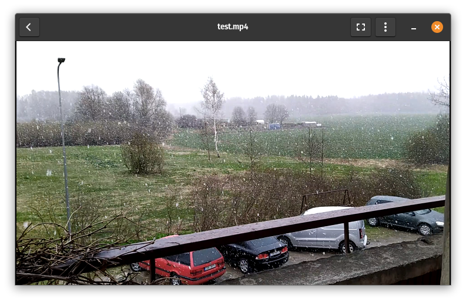
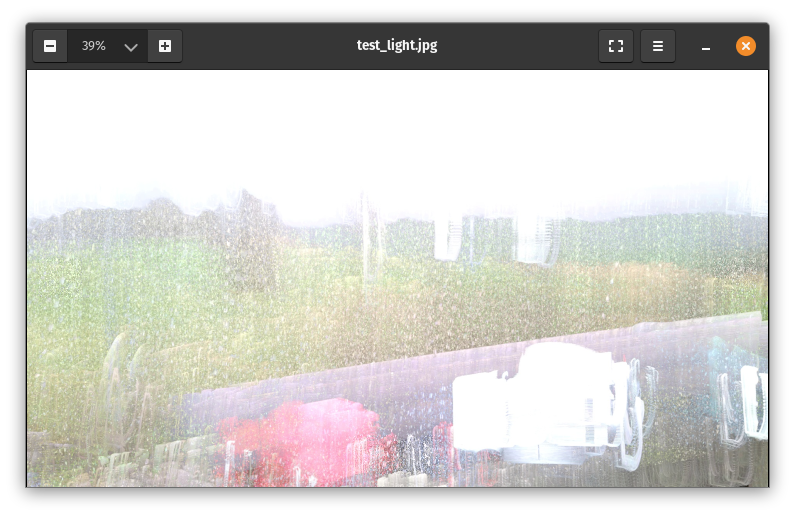
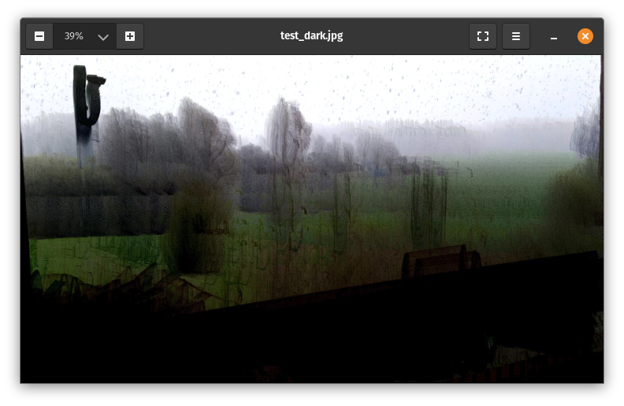

# Valgusmaal

Python3 script to create long exposure images from videos.

Input is a video file or folder with videos. Preferably short video: a few seconds long to get a good result.

The script generates two files: one contains the lightest pixels and the other darkest pixels from video.

## Usage

    python3 valgus.py

Using video file as input:

    ./valgus.py -v video.mp4

Using video file as input and resizing output image:

    ./valgus.py -v video.mp4 -r 800

Using folder as input:

    ./valgus.py -f folder

Using folder as input and resizing all output images:

    ./valgus.py -f folder -r 1024

## Example images

 ___

Tauno Erik https://taunoerik.art Copyright 2021